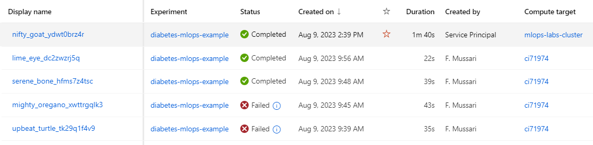

Reproducing this tutorial:   
[https://microsoftlearning.github.io/mslearn-azure-ml/Instructions/02-Explore-Azure-Machine-Learning.html](https://microsoftlearning.github.io/mslearn-azure-ml/Instructions/02-Explore-Azure-Machine-Learning.html)
using CLI  
  
References:  
[https://microsoftlearning.github.io/mslearn-azure-ml/Instructions/02-Explore-developer-tools.html](https://microsoftlearning.github.io/mslearn-azure-ml/Instructions/02-Explore-developer-tools.html)  
[https://microsoftlearning.github.io/mslearn-aml-cli/](https://microsoftlearning.github.io/mslearn-aml-cli/)

## Steps

0. Open the Azure portal and select the [>_] (Cloud Shell) button at the top of the page to the right of the search box.

1. ```
   git clone https://github.com/fmussari/mslearn-mlops.git mslearn-mlops
   cd mslearn-mlops
   code .
   ```
  
2. Remove any ML CLI extensions (both version 1 and 2) to avoid any conflicts with previous versions with this command:  
   `az extension remove -n azure-cli-ml`  
   `az extension remove -n ml`

3. Install the Azure Machine Learning (v2) extension with the following command:  
   `az extension add -n ml -y`
  
4. Create a Resoruce Group:  
  `az group create --name "rg-mlops-labs" --location "eastus"`

5. Create an Azure Machine Learning workspace:  
  `az ml workspace create --name "mlw-mlops-labs" -g "rg-mlops-labs"`

6. Create a compute instance in your workspace:  
   `az ml compute create --name "ci71974" --size STANDARD_DS11_V2 --type ComputeInstance -w mlw-mlops-labs -g rg-mlops-labs`  
  
7. Use the CLI (v2) to create a registered data asset:  
  a. Option without .yml [link](https://learn.microsoft.com/en-us/cli/azure/ml/data?view=azure-cli-latest#az-ml-data-create)  
    `az ml data create --name diabetes-dev-folder --version 1 --path experimentation/data -w mlw-mlops-labs -g rg-mlops-labs`  
  b. Option with .yml [link](https://learn.microsoft.com/en-us/azure/machine-learning/reference-yaml-data?view=azureml-api-2)  

8. Run the job:  
   `az ml job create --file ./src/job.yml -w mlw-mlops-labs -g rg-mlops-labs`
  
**I'm not sure about the need to create a registered data asset.**  
**Ran OK**

## Challenge 2: Trigger the Azure Machine Learning job with GitHub Actions
https://microsoftlearning.github.io/mslearn-mlops/documentation/02-github-actions  

1. Login:  
   `az login`  
3. Create a service principal:  
   ```
   az ad sp create-for-rbac --name "sp-mlops-labs" --role contributor \  
   --scopes /subscriptions/<subscription-id>/resourceGroups/rg-mlops-labs \  
   --sdk-auth
   ```  
4. Create a GitHub secret in your repository. Name it `AZURE_CREDENTIALS` and copy and paste the output of the service principal to the Value field of the secret.

Reference: 
[https://learn.microsoft.com/en-us/training/modules/automate-machine-learning-workflows/4-github-actions](https://learn.microsoft.com/en-us/training/modules/automate-machine-learning-workflows/4-github-actions)

5. Edit the 02-manual-trigger.yml workflow to trigger the Azure Machine Learning job you defined in challenge 1.
(The service principal is only allowed to submit jobs that use a compute cluster, not a compute instance.)

   a. Create the cluster:  
   `az ml compute create --name "mlops-labs-cluster" --size STANDARD_DS11_V2 --max-instances 2 --type AmlCompute -w mlw-mlops-labs -g rg-mlops-labs`  
   b. Create a copy of `job.yml` named `job-gh-actions.yml` for this porpuse, and reference the compute cluster instead of the instance.



## Delete the ML Workspace to continue tomorrow
`az ml workspace delete -n mlw-mlops-labs -g rg-mlops-labs`


## Challenge 3: Trigger GitHub Actions with feature-based development

### Creating a branch

Reference:  
- Youtube: [GitHub branch rules (protect your git branches)](https://youtu.be/CNCE1gts2Yw)
- [3.2 Git Branching - Basic Branching and Merging](https://git-scm.com/book/en/v2/Git-Branching-Basic-Branching-and-Merging)

```
$ git branch -c chall3branch
$ git checkout chall3branch
```
After doing changes and creating `chall3pr.yml`
```
$ git add .
$ git commit -m <message>
$ git push origin HEAD
```
  
The merge was done in github UI   
  

### New Day, create resources again
```
$ az ml workspace create --name "mlw-mlops-labs" -g "rg-mlops-labs"
$ 
```

## References
- [Build and operate machine learning solutions with Azure Machine Learning](https://learn.microsoft.com/en-us/training/paths/build-ai-solutions-with-azure-ml-service/)
- https://microsoftlearning.github.io/mslearn-dp100/
  
- [Explore developer tools for workspace interaction](https://learn.microsoft.com/en-us/training/paths/explore-azure-machine-learning-workspace/)
- https://microsoftlearning.github.io/mslearn-azure-ml/
  
- [End-to-end machine learning operations (MLOps) with Azure Machine Learning](https://learn.microsoft.com/en-us/training/paths/build-first-machine-operations-workflow/)
- https://microsoftlearning.github.io/mslearn-mlops/
  
- [Train models in Azure Machine Learning with the CLI (v2)](https://learn.microsoft.com/en-us/training/paths/train-models-azure-machine-learning-cli-v2/)
- https://microsoftlearning.github.io/mslearn-aml-cli/
  
- [Azure MLOps (v2) Solution Accelerator](https://github.com/Azure/mlops-v2)
  
- [Machine Learning Operations (MLOps) Challenge](https://learn.microsoft.com/en-us/users/cloudskillschallenge/collections/47mnu0dq1j4z?WT.mc_id=cloudskillschallenge_150df021-d77d-4e78-b51c-76743f48a4c9)

- [Exam DP-100: Designing and Implementing a Data Science Solution on Azure](https://learn.microsoft.com/en-us/certifications/exams/dp-100/)